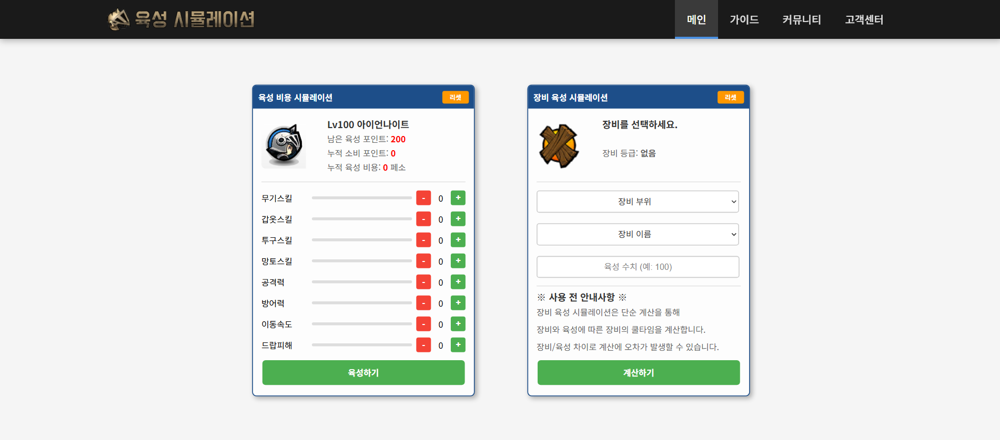

# ls-growsim

**Lost Saga Training Simulation**  
A web-based tool for simulating character and equipment setups in ***KLS** Lost Saga*.
---

## ✨ Features
- **Hero & Equipment Simulation**: Test various character and gear combinations in real time.  
- **Cooldown & Stats Analysis**: Dynamically calculate cooldowns, stats, and performance.  
- **Visualization Tools**: Cooldown tables and stat charts for easier comparison.  
- **Utility Functions**: save/load system, and replay options for repeated testing.  

## 🎬 Demo Video 

- **Click the image below to see the features in action on YouTube**

[](https://www.youtube.com/watch?v=kowQr0Dwzh8)
---

## 🛠 Tech Stack
| Layer        | Tech & Frameworks         |
|--------------|---------------------------|
| **Backend**  | Node.js, Express, MongoDB |
| **Frontend** | React (with TypeScript)   |
| **Language** | TypeScript / JavaScript   |

---

## 📂 Project Structure

```plaintext
ls-growsim/
├─ backend/                # Backend (Node.js + Express + MongoDB)
│  ├─ src/
│  │  ├─ controllers/      # Request handlers
│  │  ├─ routes/           # API route definitions
│  │  ├─ models/           # Mongoose schemas & models
│  │  ├─ utils/            # Utility functions & helpers
│  │  └─ index.ts          # Entry point for the server
│  ├─ package.json
│  └─ ...
│
├─ frontend/               # Frontend (React + TypeScript)
│  ├─ src/
│  │  ├─ components/       # Reusable UI components
│  │  ├─ pages/            # Page-level components
│  │  ├─ hooks/            # Custom React hooks
│  │  ├─ services/         # API calls & data handling
│  │  └─ main.tsx          # Entry point for the app
│  ├─ package.json
│  └─ ...
│
├─ database/               # Database (MongoDB Data)
│  ├─ users.json           # users json
│  ├─ equipments.json      # equipments json
│
├─ .env.example            # Environment variable template
└─ README.md
```

---

## 🚀 Getting Started

### 1. Clone the repository
```bash
git clone https://github.com/xinoss/ls-growsim.git
cd ls-growsim
```

### 2. Install dependencies

**Backend:**
```bash
cd backend
npm install
```

**Frontend:**
```bash
cd frontend
npm install
```

### 3. Setup environment variables

- **configure your MongoDB URI, server port, etc.** 

**Window:**
```bash
copy .env.example .env
```

**macOS / Linux:**
```bash
cp .env.example .env
```

### 4. Setup MongoDB 

- **Initial ID:** admin  
- **Initial Password:** 1234

```bash
cd database
mongoimport --uri "your_mongodb_uri" --db ls-growsim --collection users --file users.json --jsonArray
mongoimport --uri "your_mongodb_uri" --db ls-growsim --collection equipments --file equipments.json --jsonArray
```

### 5. Run the app

**Backend:**
```bash
npm run dev
# or
node index.js
# or
node .
```

**Frontend:**
```bash
npm run dev
# or
npm run build
```

---

## 🤝 Contributing
Pull requests are welcome! For major changes, please open an issue first to discuss what you would like to change.  
